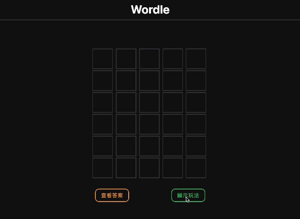
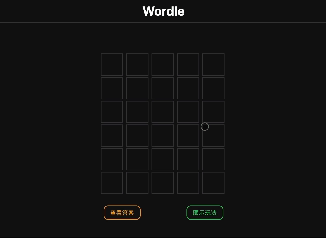

   <h1>Wordle</h1>

  

   <a href="#wordle">About</a>
    ｜
   <a href="#language">Tech</a>
    ｜
   <a href="#demo">Demo</a>
  

  

  

# Wordle

A clone of world famous word-guessing game.

## About Reminded's Tech Stack

### Language

### Library

  

### Tools and Services

  

### Details

- Managed state with `Context API` and `useReducer`.
- Implemented `TypeScript` for type safety.
- Imported `Tailwind` and `NextUI` for rapid development and applied atomic concept for CSS.

## Demo

### Display rules and reset game

### Guess Word

###### Play Wordle by directly typing the guessing word and hit `Enter`

